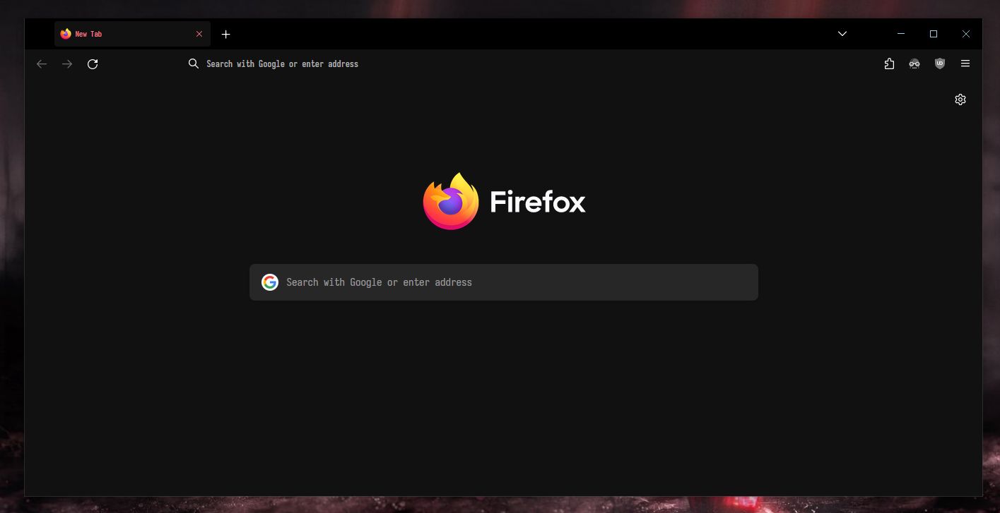

# Firefox userChrome

## Install

1. open `about:config` and change `toolkit.legacyUserProfileCustomizations.stylesheets` to `true`
2. open `about:support`
3. open profile folder by clicking "Profile Folder" -> "Open Folder"
4. create sub-folder named "chrome"
5. copy files `userChrome.css` and `userContent.css` into that folder
6. restart Firefox

for more infomation see [r/FirefoxCSS](https://reddit.com/r/FirefoxCSS)